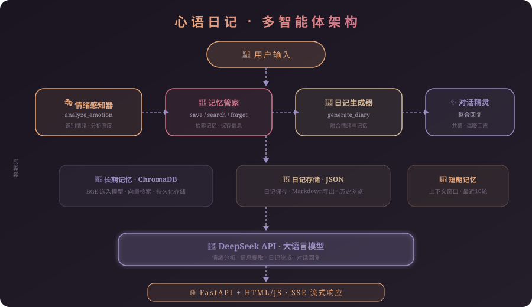

# 📔 心语日记 — 多智能体 AI 日记助手

> 基于多智能体协作的个性化 AI 日记应用，能够感知情绪、记忆重要瞬间、生成温暖日记。


## 🌟 项目亮点

- **4 个智能体协作**：情绪感知器、记忆管家、日记生成器、对话精灵
- **4 个工具函数**：情绪分析、记忆保存/检索/遗忘、日记生成
- **长期记忆**：ChromaDB 向量数据库 + BGE 中文嵌入模型
- **短期记忆**：上下文窗口，保留最近 10 轮对话
- **SSE 流式响应**：实时显示每个智能体的处理进度
- **日记管理**：自动保存、历史浏览、Markdown 导出
- **精美暗色主题 UI**：响应式设计，支持移动端

## 🏗️ 架构设计



```
用户输入 → 情绪感知器(分析情绪) → 记忆管家(检索+保存) → 日记生成器(写日记) → 对话精灵(整合回复) → 用户
                ↓                       ↓                       ↓
          情绪标签+强度         ChromaDB向量检索          融合情绪+记忆
```

### 智能体角色

| 智能体 | 职责 | 工具 | 记忆权限 |
|--------|------|------|----------|
| 🎭 情绪感知器 | 识别用户情绪状态 | `analyze_emotion` | 仅当前输入 |
| 🧠 记忆管家 | 管理长期记忆 | `save_memory` / `search_memory` / `forget_memory` | 读写向量库 |
| 📝 日记生成器 | 生成个性化日记 | `generate_diary` | 读短期+长期记忆 |
| ✨ 对话精灵 | 整合温暖回复 | — | 读短期记忆 |

## 🚀 快速开始

### 环境要求

- Python 3.10+
- [DeepSeek API Key](https://platform.deepseek.com/)

### 安装步骤

```bash
# 1. 克隆项目
git clone https://github.com/w020316/geren-riji.git
cd geren-riji

# 2. 安装依赖
pip install -r requirements.txt -i https://pypi.tuna.tsinghua.edu.cn/simple

# 3. 配置环境变量
cp .env.example .env
# 编辑 .env 文件，填入你的 DeepSeek API Key

# 4. 启动服务
python main.py
```

打开浏览器访问 **http://localhost:8000**

### Docker 部署

```bash
# 构建并启动
docker-compose up -d

# 或手动构建
docker build -t xinyu-diary .
docker run -p 8000:8000 -e DEEPSEEK_API_KEY=your_key xinyu-diary
```

## 📁 项目结构

```
geren-riji/
├── main.py              # FastAPI 后端服务入口
├── agents.py            # 4个智能体 + 编排器
├── tools.py             # 工具函数（情绪分析、日记生成）
├── memory.py            # 长期记忆(ChromaDB) + 短期记忆
├── diary_store.py       # 日记持久化存储与导出
├── llm_client.py        # DeepSeek API 调用封装
├── config.py            # 配置管理
├── static/
│   └── index.html       # 前端界面（暗色主题）
├── docs/
│   └── architecture.svg # 架构图
├── requirements.txt     # Python 依赖
├── Dockerfile           # Docker 部署文件
├── docker-compose.yml   # Docker Compose 配置
├── .env.example         # 环境变量模板
└── .gitignore
```

## 🔧 API 接口

| 方法 | 路径 | 说明 |
|------|------|------|
| `POST` | `/api/chat/stream` | SSE 流式对话（推荐） |
| `POST` | `/api/chat` | 普通对话 |
| `GET` | `/api/diaries` | 获取日记列表 |
| `GET` | `/api/diaries/{id}` | 获取日记详情 |
| `DELETE` | `/api/diaries/{id}` | 删除日记 |
| `GET` | `/api/diaries/{id}/export` | 导出单篇日记(Markdown) |
| `GET` | `/api/diaries/export/all` | 导出全部日记 |
| `GET` | `/api/memories` | 获取长期记忆列表 |
| `DELETE` | `/api/memories/{id}` | 删除记忆 |
| `POST` | `/api/clear_context` | 清空短期记忆 |

## ⚙️ 环境变量

| 变量名 | 默认值 | 说明 |
|--------|--------|------|
| `DEEPSEEK_API_KEY` | — | DeepSeek API 密钥（必填） |
| `DEEPSEEK_BASE_URL` | `https://api.deepseek.com` | API 地址 |
| `DEEPSEEK_MODEL` | `deepseek-chat` | 模型名称 |
| `EMBEDDING_MODEL` | `BAAI/bge-small-zh-v1.5` | 嵌入模型 |
| `SHORT_MEMORY_MAX_TURNS` | `10` | 短期记忆轮数 |

## 📄 License

MIT License
